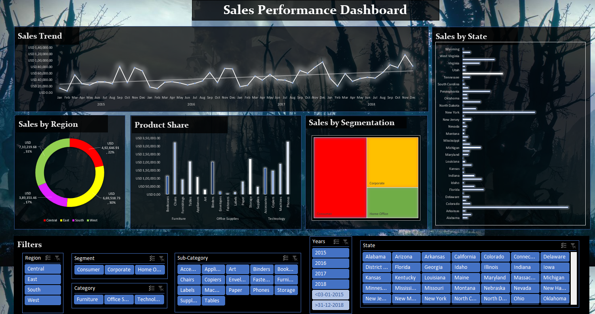

# Sales-Analytics-Project
Sales Performance Analysis Dashboard using Excel and business analytics techniques.
# 📊 Sales Performance Analysis Dashboard

## Project Overview
This project analyzes sales performance data to identify revenue trends, customer behavior, and regional performance using Microsoft Excel.

## Tools Used
- Microsoft Excel
- Pivot Tables
- Pivot Charts
- Slicers
- Conditional Formatting
- Dashboard Design

## Dataset
The project uses sales transaction data containing:
- Order details
- Customer information
- Product categories
- Sales amount
- Profit
- Regional sales performance

## Key Performance Indicators (KPIs)
- Total Sales
- Total Profit
- Number of Orders
- Profit Margin
- Regional Performance
- Category-wise Sales
- Monthly Sales Trend

## Dashboard Features
- Interactive filters using slicers
- Sales trend analysis
- Region-wise performance analysis
- Product category analysis
- Customer insights
- Profitability analysis

## Key Insights
- Identified top-performing regions.
- Analyzed sales growth trends.
- Evaluated product category performance.
- Compared profitability across segments.

## Files Included
- Sales Performance Dashboard.xlsx
- Dashboard Screenshots
- README.md

## Dashboard Preview

